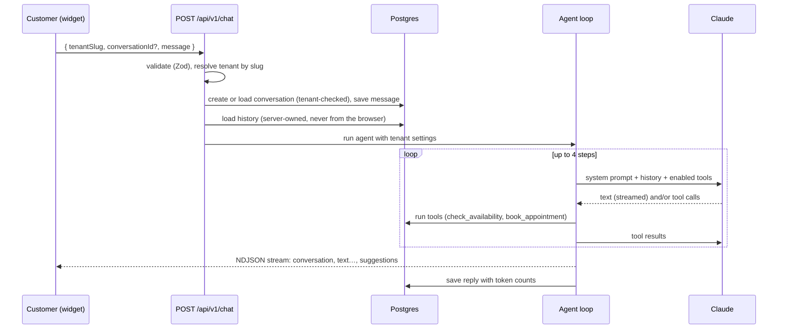
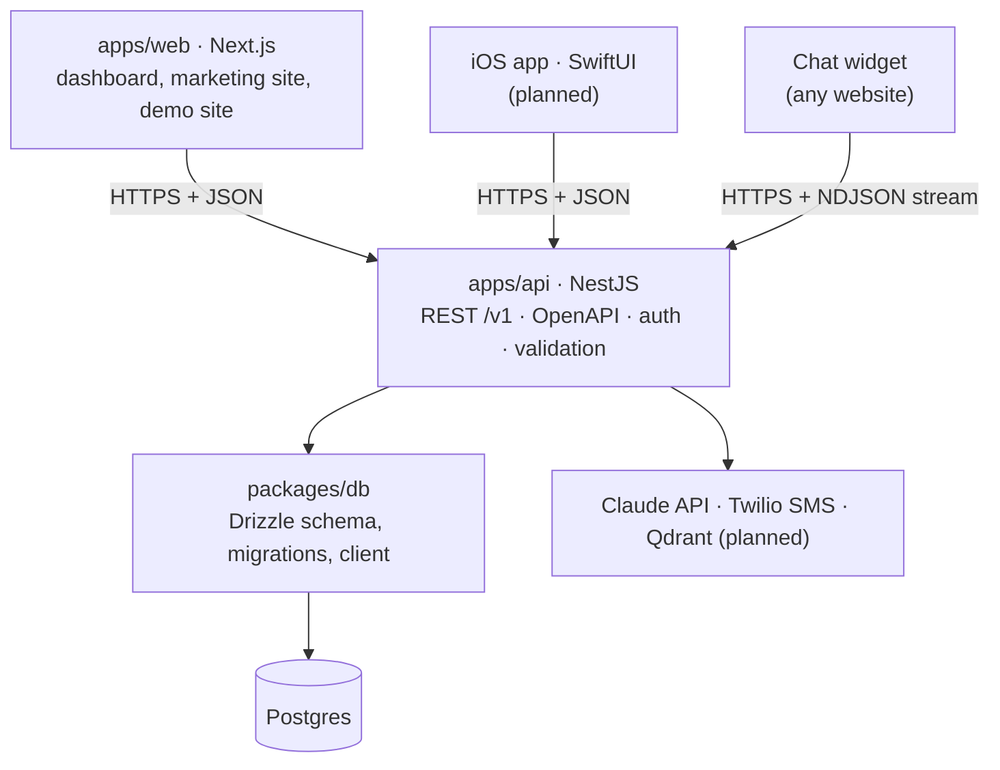

# FrontPilot

**No-code AI agents for small businesses.** A business sets up its own AI agent in minutes. The agent chats with website visitors, answers questions from the business's own information, qualifies leads, books real appointments, and keeps everything in a built-in CRM. The owner stays in control through approvals.

> Portfolio project by **Sulabh Agarwal**, built to production standards: multi-tenant data model, tool-calling agent loop, streaming, a separate NestJS API serving web and mobile, type-safe contracts end to end, and a modular monorepo.

---

## What it does

| For the business owner (dashboard) | For their customers (chat widget) |
| --- | --- |
| Configure the agent: name, greeting, tone, rules, which tools it may use | Chat on the business website through a small chat bubble |
| Overview of conversations, leads and bookings from live data | Tap suggested replies or type freely |
| Leads pipeline (New → Qualified → Booked → Won) | Get accurate answers about services, prices and hours |
| Approve or decline bookings the agent made (review mode) | Book a visit: real availability, no double bookings |
| Every conversation, with token usage per reply | Receive an SMS confirmation (with consent) |

A fictional business, **Rapid Plumbing**, is seeded as the demo tenant, with its own website at `/demo/rapid-plumbing`.

## How the agent works



**Tools the agent can call** (each validated with Zod; the tenant always comes from the server, never from the model):

| Tool | What the server does |
| --- | --- |
| `check_availability` | Computes free slots from opening hours, existing bookings and minimum notice, in the business's time zone |
| `book_appointment` | Re-checks the slot, then creates a lead and an appointment in one transaction (idempotent per conversation and slot) |
| `suggest_replies` | Display-only: 2–3 tappable reply options shown under the message |

**Guiding principle:** *the prompt guides, the code enforces.* The model can ask for a booking; code decides whether it is allowed.

## Architecture

FrontPilot is moving from a Next.js monolith to a **separate backend API** that serves every client: the web app, the chat widget, and a future SwiftUI iOS app. The migration uses the **strangler pattern**: the NestJS API grows alongside the existing app and takes over one feature at a time, so the product keeps working at every step.



**Target:** the web app becomes UI only and never touches the database. Only the API does.

### Monorepo

pnpm workspaces + Turborepo. Apps are deployable; packages are shared libraries; apps depend on packages, never the reverse.

```
apps/
  web/          Next.js (App Router): UI, being switched over to call the API
  api/          NestJS: the backend for web, iOS and the widget
packages/
  db/           Drizzle schema, migrations, seed; built with tsup to ESM + CJS + types
  api-client/   (planned) TypeScript client generated from the OpenAPI spec
```

### API structure (`apps/api/src`)

```
main.ts                     bootstrap: error filter, CORS, Swagger, shutdown hooks
app.module.ts               root module: config, database, feature modules, middleware
config/                     environment schema, validated with Zod at startup
database/                   DatabaseModule: Drizzle client provided through dependency injection
common/
  middleware/               request ID + one log line per request
  filters/                  one JSON error format for every error
  pipes/                    Zod validation for request input
  openapi/                  Zod → OpenAPI schemas for the docs
  time/                     time-zone helpers (UTC ↔ business local time)
  auth/                     global AuthGuard, TokenVerifier interface, @CurrentTenant(), @Public()
modules/
  health/                   service + database status (public)
  tenants/                  tenant lookup, GET /v1/me
  overview/  leads/  conversations/  appointments/  agent-settings/
  availability/             free slots from opening hours, bookings and time zones
  notifications/            SmsProvider interface; console or Twilio chosen by config
  (next) agent/  chat/      tool-calling agent, public streaming chat
```

Each feature module follows **controller → service → repository**: controllers handle HTTP only, services hold business logic, repositories hold queries. Cross-cutting concerns (auth, validation, errors, logging) are applied once, through guards, pipes, filters and middleware, instead of in every handler.

### API endpoints (v1)

All endpoints except `/health` require `Authorization: Bearer <token>`; the business is taken from the token, never from the request. Interactive docs: `http://localhost:4000/docs`.

| Method | Path | Purpose |
| --- | --- | --- |
| GET | `/health` | Service and database status (public) |
| GET | `/v1/me` | The business the token belongs to |
| GET | `/v1/overview` | Last 7 days: conversations, AI resolution rate, leads, bookings; items needing attention; upcoming visits |
| GET | `/v1/leads?stage=` | Leads, newest first |
| GET | `/v1/conversations?status=&limit=` | Conversations, those needing the owner first |
| GET | `/v1/conversations/:id` | One conversation with all messages |
| GET | `/v1/appointments?status=&from=` | Appointments, soonest first (UTC + business time zone) |
| POST | `/v1/appointments/:id/approve` | Confirm a pending booking; texts the customer if they consented |
| POST | `/v1/appointments/:id/decline` | Decline a pending booking; frees the slot |
| GET | `/v1/availability?date=` | Free slots on a day |
| GET / PUT | `/v1/agent-settings` | Read / replace the agent's configuration |

**Conventions:** responses use codes (`needs_owner`) and ISO-8601 UTC timestamps; clients format them. Errors share one shape: `{ "error": { statusCode, code, message, details?, requestId } }`. 400 = validation, 401 = auth, 404 = not found for this business, 409 = state conflict (e.g. already approved).

### Web structure (`apps/web/src`)

```
app/                      routes only; pages are thin
  (marketing)/  (dashboard)/dashboard/  (demo)/demo/  api/v1/chat/
features/                 agent, agent-setup, appointments, chat-widget,
                          conversations, leads, overview, notifications, demo-site
shared/                   ui (shadcn/ui), components, contracts, lib
```

Each feature exposes a public `index.ts`. As features move to the API, their `server/` folders in the web app are replaced by calls to the API client.

## Key design decisions

- **One backend for every client.** A versioned REST API (`/v1`) with an OpenAPI contract serves web, iOS and the widget; typed clients are generated from the spec (TypeScript now, Swift via Apple's Swift OpenAPI Generator).
- **Incremental migration (strangler pattern).** The API takes over feature by feature; the product never stops working.
- **Multi-tenant from day one.** Every table has `tenant_id`; every query takes a tenant; IDs from clients are always checked against the tenant (prevents IDOR).
- **Secure and consistent by default.** Validated config at startup; Zod validation on every input; one error format with a request ID; CORS allow-list; a global auth guard (endpoints opt out explicitly).
- **Dependency injection for everything external.** Database, LLM and SMS providers are injected, so tests use fakes and providers are swapped by configuration.
- **Auth behind an interface.** The global guard depends on a `TokenVerifier` interface; the development token verifier can be replaced by a real identity provider without touching controllers. Secrets are compared in constant time.
- **Meaningful HTTP semantics.** 404 for resources outside the caller's business, 409 for state conflicts, 400 with per-field details for validation.
- **Server-owned chat history.** The widget sends only the new message; history is loaded from the database, so a client cannot inject fake past messages.
- **Streaming with a typed event protocol.** NDJSON events (`conversation`, `text`, `suggestions`, `error`) defined once with Zod and shared by server and widget.
- **The prompt guides, the code enforces.** The model can request a booking; code checks availability, re-validates the slot and writes the data in a transaction.
- **Separate state machines.** Conversation status and appointment status are independent and updated together in transactions.
- **Time zones done properly.** Times are stored in UTC and computed in the business's own zone, including daylight-saving changes.
- **Concurrency-safe approvals and idempotent bookings.** Updates are conditional on current status; retries never double-book.
- **Consent-aware messaging.** The agent asks before texting; consent is stored per lead; a failed SMS never breaks a booking.

## Tech stack

| Area | Choice |
| --- | --- |
| Language | TypeScript (strict, `noUncheckedIndexedAccess`) |
| Web | Next.js 16 (App Router, Server Components, Server Actions), React 19 |
| UI | Tailwind CSS 4, shadcn/ui (Base UI), lucide icons |
| API | NestJS 12 (modules, dependency injection, guards, pipes, filters), Express |
| API docs | OpenAPI / Swagger via `@nestjs/swagger`, schemas generated from Zod |
| AI | Anthropic Claude via `@anthropic-ai/sdk` (tool use, streaming); Claude Haiku 4.5 by default |
| Database | Postgres 17 (Docker), Drizzle ORM + Drizzle Kit migrations |
| Validation | Zod (config, API input, forms, tool input, stream events) |
| Messaging | Twilio SMS (REST) behind a provider interface |
| Tooling | pnpm workspaces, Turborepo, tsup, Prettier, ESLint |

## Getting started

**Prerequisites:** Node.js 20+, pnpm (via `corepack enable`), Docker Desktop, an [Anthropic API key](https://console.anthropic.com).

```bash
# 1. Install dependencies
pnpm install

# 2. Configure environment (each app owns its own env file)
cp apps/web/.env.example apps/web/.env.local   # then set ANTHROPIC_API_KEY
cp apps/api/.env.example apps/api/.env.local   # then set DEV_AUTH_TOKEN (openssl rand -hex 24)

# 3. Start Postgres, create tables, load demo data
pnpm db:up
pnpm db:migrate
pnpm db:seed

# 4. Run everything (builds packages/db first, then starts web + api)
pnpm dev
```

Then open:

| URL | What |
| --- | --- |
| http://localhost:3000 | Landing page |
| http://localhost:3000/dashboard | Business dashboard (demo tenant) |
| http://localhost:3000/demo/rapid-plumbing | Demo business website with the chat widget |
| http://localhost:4000/docs | API documentation (Swagger, try requests live) |
| http://localhost:4000/health | API and database status |

## Scripts

| Command | Purpose |
| --- | --- |
| `pnpm dev` | Run all apps in development |
| `pnpm build` / `pnpm typecheck` / `pnpm lint` | Build, type-check, lint all workspaces |
| `pnpm format` | Format with Prettier |
| `pnpm db:up` / `pnpm db:down` | Start / stop local Postgres |
| `pnpm db:generate` | Create a SQL migration after changing `packages/db/src/schema.ts` |
| `pnpm db:migrate` | Apply pending migrations |
| `pnpm db:seed` | Reset the demo tenant with sample data |
| `pnpm db:psql` / `pnpm db:studio` | Inspect the database (terminal / browser) |

## Roadmap

**Product**
- [x] Monorepo, feature architecture, design system
- [x] Owner dashboard: overview, conversations, leads pipeline, appointments, agent setup
- [x] Demo business site with streaming chat widget and suggested replies
- [x] AI agent with tool calling and a multi-step loop
- [x] Postgres with Drizzle: schema, migrations, seed, live dashboard data
- [x] Real bookings: availability, time zones, approvals, SMS notifications with consent

**Backend API migration (NestJS)**
- [x] A. Foundation: app, validated config, database module, request IDs and logging, error filter, CORS, Swagger
- [x] B. Tenancy and auth: global guard, `TokenVerifier` interface, `@CurrentTenant()`, `@Public()`
- [x] C. Endpoints: overview, leads, conversations (+ detail), appointments, agent settings (GET/PUT)
- [x] D. Domain actions: notifications (SMS provider via DI), availability, approve / decline
- [ ] E. Agent and public chat: tools as providers, streaming `/v1/chat`, rate limiting
- [ ] F. Web app switches to the API via a generated client; database access removed from web
- [ ] G. Tests (unit + end-to-end) and CI

**Next**
- [ ] Knowledge base (RAG): document upload, chunking, embeddings, Qdrant search
- [ ] Authentication and organizations (one dashboard per business)
- [ ] Deployment: web on Vercel; API, Postgres and Qdrant on managed hosting
- [ ] Evals and tracing: quality checks on every prompt change, cost per tenant
- [ ] Embeddable `<script>` widget for any website
- [ ] SwiftUI companion app for owners, using a Swift client generated from the OpenAPI spec

## License

Portfolio project. All business data in this repository (Rapid Plumbing, customers, phone numbers) is fictional.
