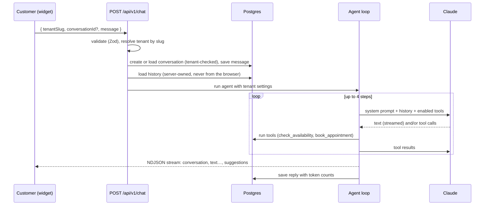
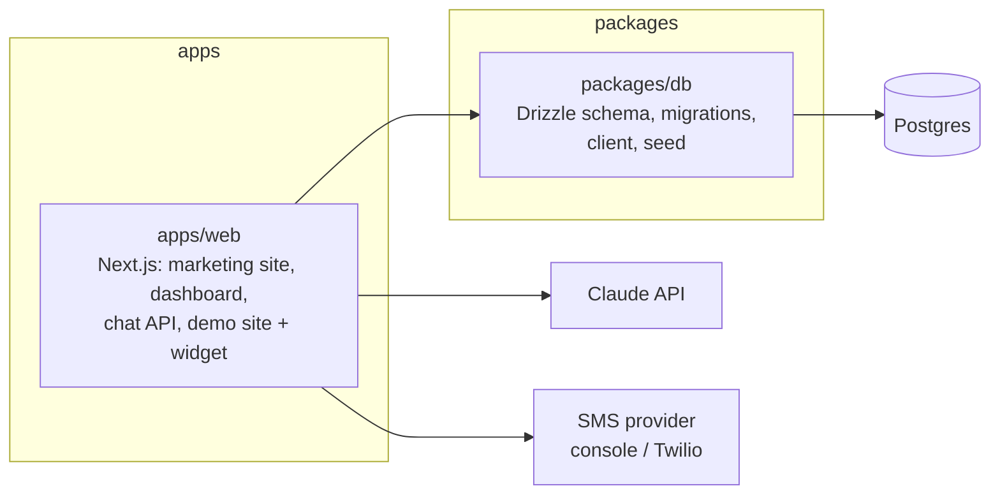

# FrontPilot

**No-code AI agents for small businesses.** A business sets up its own AI agent in minutes. The agent chats with website visitors, answers questions from the business's own information, qualifies leads, books real appointments, and keeps everything in a built-in CRM. The owner stays in control through approvals.

> Portfolio project by **Sulabh Agarwal**, built to production standards: multi-tenant data model, tool-calling agent loop, streaming, type-safe contracts end to end, and a modular monorepo.

---

## What it does

| For the business owner (dashboard) | For their customers (chat widget) |
| --- | --- |
| Configure the agent: name, greeting, tone, rules, which tools it may use | Chat on the business website through a small chat bubble |
| Overview of conversations, leads and bookings from live data | Tap suggested replies or type freely |
| Leads pipeline (New → Qualified → Booked → Won) | Get accurate answers about services, prices and hours |
| Approve or decline bookings the agent made (review mode) | Book a visit: real availability, no double bookings |
| Every conversation, with token usage per reply | Receive an SMS confirmation (with consent) |

A fictional business, **Rapid Plumbing**, is seeded as the demo tenant, with its own website at `/demo/rapid-plumbing`.

## How the agent works



**Tools the agent can call** (each validated with Zod; the tenant always comes from the server, never from the model):

| Tool | What the server does |
| --- | --- |
| `check_availability` | Computes free slots from opening hours, existing bookings and minimum notice, in the business's time zone |
| `book_appointment` | Re-checks the slot, then creates a lead and an appointment in one transaction (idempotent per conversation and slot) |
| `suggest_replies` | Display-only: 2–3 tappable reply options shown under the message |

**Guiding principle:** *the prompt guides, the code enforces.* The model can ask for a booking; code decides whether it is allowed.

## Architecture



**Monorepo:** pnpm workspaces + Turborepo. Apps are deployable; packages are shared libraries. Apps depend on packages, never the reverse.

**Feature-based structure** inside `apps/web/src`:

```
app/                      routes only; pages are thin
  (marketing)/            landing page
  (dashboard)/dashboard/  owner dashboard
  (demo)/demo/            fictional business site
  api/v1/chat/            public chat endpoint
features/
  agent/                  prompt, agent loop, tools
  agent-setup/            settings form, Server Action, Zod schema
  appointments/           availability, booking, approvals
  chat-widget/            embeddable chat UI, stream client
  conversations/          list + storage
  leads/  overview/  notifications/  demo-site/
shared/
  ui/                     shadcn/ui base components
  components/             app shell, page header, badges
  contracts/              chat event + request schemas shared by client and server
  lib/                    tenant, formatting, time zones
```

Each feature exposes a public `index.ts`; other code imports only from there. Data access lives in each feature's `server/` folder, so pages and components never know where data comes from.

## Key design decisions

- **Multi-tenant from day one.** Every table has `tenant_id`; every query takes a tenant; IDs from the browser are always checked against the tenant (prevents IDOR).
- **Server-owned chat history.** The widget sends only the new message; history is loaded from the database, so a client cannot inject fake past messages.
- **Streaming with a typed event protocol.** NDJSON events (`conversation`, `text`, `suggestions`, `error`) defined once with Zod and shared by server and widget.
- **Separate state machines.** Conversation status ("does the owner need to act?") and appointment status ("is the visit happening?") are independent and updated together in transactions.
- **Time zones done properly.** Times are stored in UTC and computed in the business's own zone, including daylight-saving changes.
- **Concurrency-safe approvals.** Updates are conditional on the current status, so double-clicks and simultaneous approvals cannot conflict.
- **Pluggable providers.** SMS goes through one interface (`console` for development, `twilio` for real texts), selected by an environment variable. A failed notification never breaks a booking.
- **Consent-aware messaging.** The agent asks before texting; consent is stored per lead.

## Tech stack

| Area | Choice |
| --- | --- |
| Language | TypeScript (strict, `noUncheckedIndexedAccess`) |
| Web | Next.js 16 (App Router, Server Components, Server Actions), React 19 |
| UI | Tailwind CSS 4, shadcn/ui (Base UI), lucide icons |
| AI | Anthropic Claude via `@anthropic-ai/sdk` (tool use, streaming); Claude Haiku 4.5 by default |
| Database | Postgres 17 (Docker), Drizzle ORM + Drizzle Kit migrations |
| Validation | Zod (forms, API input, tool input, stream events) |
| Messaging | Twilio SMS (REST) behind a provider interface |
| Tooling | pnpm workspaces, Turborepo, Prettier, ESLint |

## Getting started

**Prerequisites:** Node.js 20+, pnpm (via `corepack enable`), Docker Desktop, an [Anthropic API key](https://console.anthropic.com).

```bash
# 1. Install dependencies
pnpm install

# 2. Configure environment
cp apps/web/.env.example apps/web/.env.local
#    then set ANTHROPIC_API_KEY in apps/web/.env.local

# 3. Start Postgres, create tables, load demo data
pnpm db:up
pnpm db:migrate
pnpm db:seed

# 4. Run the app
pnpm dev
```

Then open:

| URL | What |
| --- | --- |
| http://localhost:3000 | Landing page |
| http://localhost:3000/dashboard | Business dashboard (demo tenant) |
| http://localhost:3000/demo/rapid-plumbing | Demo business website with the chat widget |

## Scripts

| Command | Purpose |
| --- | --- |
| `pnpm dev` | Run all apps in development |
| `pnpm build` / `pnpm typecheck` / `pnpm lint` | Build, type-check, lint all workspaces |
| `pnpm format` | Format with Prettier |
| `pnpm db:up` / `pnpm db:down` | Start / stop local Postgres |
| `pnpm db:generate` | Create a SQL migration after changing `packages/db/src/schema.ts` |
| `pnpm db:migrate` | Apply pending migrations |
| `pnpm db:seed` | Reset the demo tenant with sample data |
| `pnpm db:psql` / `pnpm db:studio` | Inspect the database (terminal / browser) |

## Roadmap

- [x] Monorepo, feature architecture, design system
- [x] Owner dashboard: overview, conversations, leads pipeline, appointments, agent setup
- [x] Demo business site with streaming chat widget and suggested replies
- [x] AI agent with tool calling and a multi-step loop
- [x] Postgres with Drizzle: schema, migrations, seed, live dashboard data
- [x] Real bookings: availability, time zones, approvals, SMS notifications with consent
- [ ] Knowledge base (RAG): document upload, chunking, embeddings, Qdrant search
- [ ] Authentication and organizations (one dashboard per business)
- [ ] Automated tests, CI (GitHub Actions) and deployment
- [ ] Evals and tracing: quality checks on every prompt change, cost per tenant
- [ ] Embeddable `<script>` widget for any website
- [ ] SwiftUI companion app for owners (approve bookings on the go)

## License

Portfolio project. All business data in this repository (Rapid Plumbing, customers, phone numbers) is fictional.
